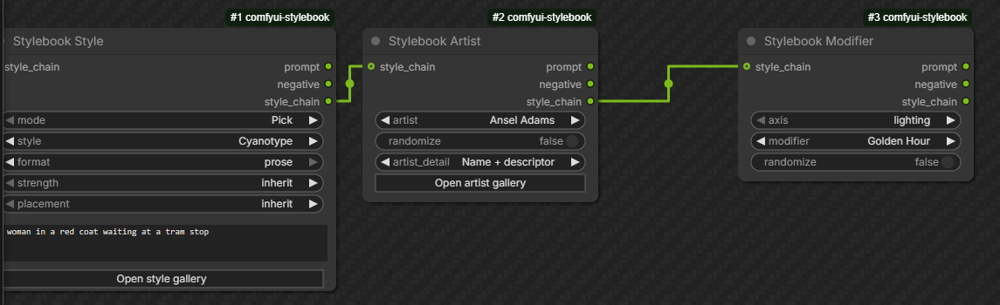
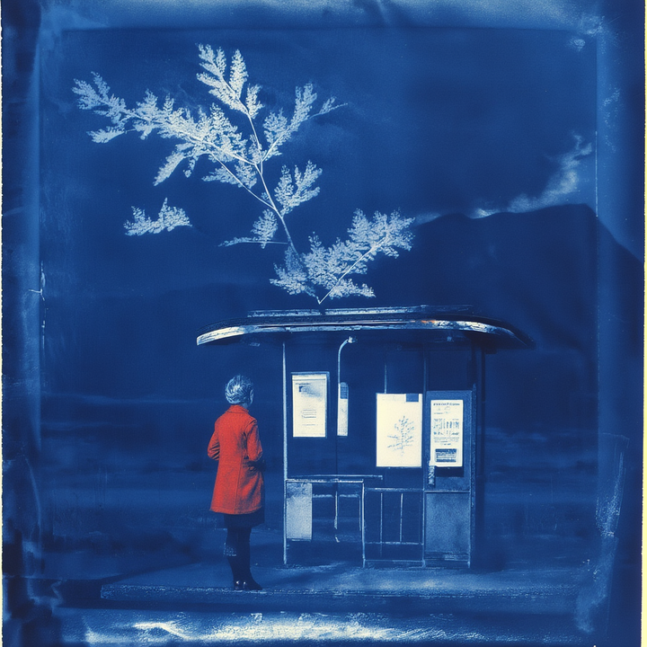
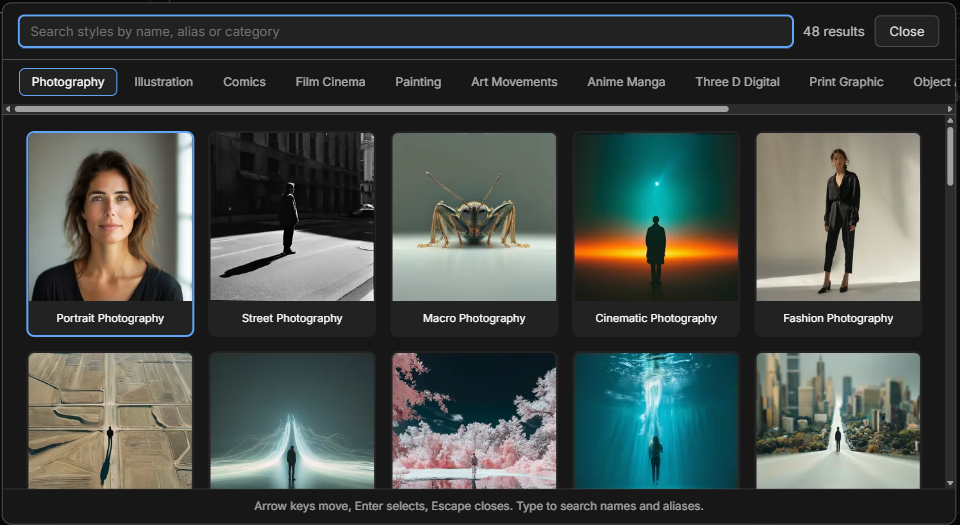
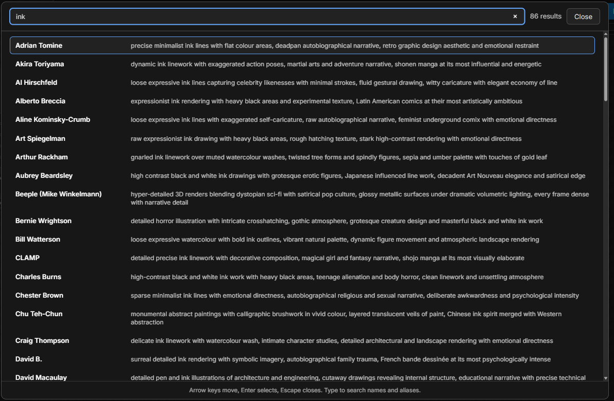

# Stylebook

**430+ visual styles for ComfyUI, every one with a rendered preview you can
browse before you commit.**

Stop guessing whether "wet plate collodion" or "risograph" will do what you
want. Open the gallery, look at it, click it.





That chain, run as-is: subject `a woman in a red coat waiting at a tram
stop`, style **Cyanotype**, artist **Ansel Adams** as descriptor only,
**Golden Hour** lighting. The coat stays red through a monochrome
process because the subject leads the prompt and the style trails it.

<br clear="right">

Every style ships four things: a written description, a keyword list, a
matching negative prompt, and a preview image. 650+ artists ship a written
descriptor each, so the look still lands when the name means nothing to
your model. No dependencies, no downloads, no network calls, no API keys.

## Install

In ComfyUI Manager, search for **Stylebook**. Or:

```bash
cd ComfyUI/custom_nodes
git clone https://github.com/EnragedAntelope/comfyui-stylebook.git
```

Restart ComfyUI. The nodes are under `conditioning/stylebook`.

## Quick start

1. Add **Stylebook Style**. It defaults to Random, so it produces a style
   the moment you hit Run.
2. Type your subject into `user_prompt`, for example
   `a woman in a red coat waiting at a tram stop`.
3. Click **Open style gallery** and pick something you like the look of.
4. Wire `prompt` into a CLIPTextEncode and `negative` into a second one.
5. Chain **Artist** and **Modifier** after it if you want more.

Style, Artist and Modifier all read the same way: a `mode` widget on top
set to Pick, Random or Cycle, then the picker, then the filters that
narrow what Random and Cycle draw from. Only the widgets the current mode
actually uses stay on the node.



## The five nodes

| Node | What it does |
|---|---|
| **Style** | The medium. Pick from the gallery, draw a seeded Random from a filtered pool, or Cycle a whole category by index. Exclusive: a second Style node replaces the first. |
| **Artist** | Layers one artist. Chain up to five. Pick, Random or Cycle, same as Style. Search 650+ by name, movement, category, or by what their work actually looks like. |
| **Modifier** | Tilts one axis: lighting, colour grade, era, finish or mood. 65+ modifiers, each with a description you can browse. One per axis. |
| **Blend** | Mixes two styles at a ratio that genuinely shifts the balance, not just the endpoints. |
| **Sheet** | One subject rendered across many styles as a batch. Choose them yourself from the gallery, or leave the list empty and let a seeded draw fill it. |

## Best practices

**Chain in this order: Style, Artist, Modifier.**

```
Style -> Artist -> Modifier -> CLIPTextEncode -> sampler
```

Style carries your subject through the chain, so it goes first. Artists
stack, so they sit in the middle where you can add or drop one freely.
Modifiers are the finishing pass.

You can read `prompt` off **any** node in the chain. Each one re-renders
the whole prompt from scratch, so tapping the middle gives you a correct
partial result.

**Pick the format your model likes.** `prose` writes the style as a plain
sentence. `tags` writes it as a comma-separated keyword list. Every style
ships both, so switching costs nothing and takes one click. If your model
responds better to keyword lists than to sentences, use `tags`.

**`placement` defaults to `append`, which is what prose wants.** Your
subject leads and the style follows it. That ordering matters more than
it sounds: leading with a paragraph about film grain and naming your
subject last is the easiest way to get the style honoured and the subject
ignored. Switch to `prepend` when you are using `tags`, because a keyword
list weights its leading terms most.

**In prose, the style is introduced rather than just appended.** A style
described as a noun phrase, tacked on bare, reads as another thing in the
picture: chain a subject description into the View-Master Slide style and
you get a View-Master in the image instead of an image that looks like
one. So prose output marks the boundary explicitly.

```
A woman in a red coat waiting at a tram stop. Rendered as a View-Master
stereo slide with a cardboard mount holding a plastic film strip, twin
image frames, by Harry Clarke, intricate stained-glass inspired ink
drawings with jewelled colour.
```

With `prepend` the same boundary is marked from the other side, so the
style leads and `The image shows ...` introduces your subject. Keyword
lists get no connective, because a keyword list has no grammar to
confuse.

**Wire the `negative` output if your workflow uses one.** Every style
ships a hand-written negative saying what it is *not*.

Tested on Ligne Claire at one seed: with the negative, clean uniform line
and flat unmodulated colour. Without it, the line quality survives but the
flat colour and absence of shading do not. The positive carries the
affirmative properties; the negative carries the exclusions.

If you run at CFG 1, where no negative applies at all, styles defined by
what they exclude will read softer. Most styles are unaffected.

**A style can shape the scene, not just the render.** Some name their own
subject because the subject *is* the style: Ikebana is an arrangement of
flowers, Bonsai is a tree, the Tarantino trunk shot needs a car. Those
will assert themselves over your prompt, by design. Genre styles behave
the same way. If you want a style's look without its subject, drop
`strength` to `subtle`, which keeps only the defining phrase.

**If your model does not know an artist's name**, set `artist_detail` to
`Descriptor only`. The name drops out and the written description does the
work. This is the whole reason every artist has one.

**Two or three artists, not five.** The cap is five, but descriptors start
blending together past three. `Names + lead descriptor` keeps stacked
artists distinct.

**Do not fight a style that already owns an axis.** A Cyanotype fixes its
own colour grade, so a Sepia modifier fights it. The node tells you when
this happens instead of quietly producing mud.

## Finding things

`tag_filter` is comma-separated and every term must match, so `ink, flat`
finds styles that are both. It searches tags, descriptions, names and
aliases, which means an old name still finds the style that absorbed it:
searching `reverse harem` finds Otome Game.

The artist picker searches descriptions too, so you can find someone by
what their work looks like rather than needing to know who they are.
Searching `ink` returns 86 of them.



**Random keeps its meaning across updates. Cycle does not, by design.**

A seed does not index into a sorted list, because adding one new artist
would shift every later index and silently change what every saved
workflow produces. Each candidate is scored against the seed
independently, so shipping a new entry only changes the seeds where the
newcomer happens to score highest: roughly one seed in N rather than all
of them, which at this size is a fraction of a percent. Reordering the
data changes nothing at all.

`Cycle` is the opposite and is meant to be. It steps the filtered pool by
index and wraps at the end, which is how you sweep a category
systematically, but an index is a position in an alphabetical list, so
adding entries shifts what any given index returns. Use Cycle to explore
and Random to reproduce.

**Stylebook Sheet** emits one prompt per style as a real list, so a
batched sampler renders the whole contact sheet in a single run. Its
`style_names` output tells you which style produced which image, in the
same order. Anything on its `style_chain` input applies to every entry,
so you can pin an artist and a lighting modifier and then sweep forty
mediums against them.

Click **Choose styles** to pick exactly which ones and in what order; the
gallery stays open and numbers each pick as you go. While that list has
anything in it, it wins outright and `count`, `category` and `tag_filter`
are ignored, because a list you typed out should not be silently trimmed.
Clear the list and the seeded draw takes over again.

You can type into that box directly, one name per line or comma
separated, and aliases work: `Ukiyo-e` finds Woodblock Print. A name that
matches nothing is skipped and said so, and an alias claimed by two
styles comes back naming both rather than guessing between them.

## Categories

Photography, Film & Cinema, Illustration, Painting, Art Movements,
Anime & Manga, Comics, 3D & Digital, Print & Graphic, Object & Artifact,
Craft & Material, Collage & Mixed.

## Custom styles

Drop a `user_styles.json` in the pack root; copy `user_styles.example.json`
to start. Styles, artists and modifiers all merge over the built-ins and
survive a `git pull`. It is parsed as plain JSON, and no code is executed.

## Using Stylebook with Identity Forge

[Identity Forge](https://github.com/EnragedAntelope/comfyui-identity-forge)
describes the *subject*. Stylebook describes the *rendering*. Connect
Identity Forge's `prose` output into Stylebook's `user_prompt` and chain
Stylebook downstream.

The split is by what each pack is describing, not by which one got
there first:

- **Identity Forge owns the subject.** Who or what is in the picture, and
  also where the camera is: framing, shot type, pose, expression, eye
  contact. Stylebook never touches composition.
- **Stylebook owns the rendering.** What process produced the image, plus
  the lighting, colour grade, era, finish and mood it was rendered with.

So set Identity Forge's `lighting` and `mood` to `None` and leave its
shot type alone. See `examples/stylebook_with_identity_forge.json` for a
ready-to-run workflow.

## About the previews

Each thumbnail is one model's reading of one style, on one subject, at one
seed. Styles are written to be portable, but nothing reads identically
everywhere. Treat the gallery as a guide, not a guarantee.

## Bug reports and suggestions welcome

This is actively developed and feedback is genuinely wanted. Please open
an issue for any of it:

- **Something is broken or behaves oddly.** Include your ComfyUI version
  and, if the browser console printed anything, paste it. Frontend bugs
  here have a habit of passing every test while being visibly wrong, so a
  screenshot is worth a lot.
- **A style does not look like its name.** Say which style, which model,
  and what you got instead. Style text is written to be portable, but
  nothing reads identically on every model and that is exactly the sort
  of thing worth knowing about.
- **A style, artist or modifier is missing.** Name it and, if you can,
  say what its look actually consists of. Artists in particular are more
  useful with a description than with a name.
- **A descriptor is wrong or unfair.** These are one-line summaries of
  real people's work and some of them will be clumsy. Tell us.

Pull requests are welcome too. `ARCHITECTURE.md` covers the layout, the
chain protocol and how to add a style. Run
`python scripts/pre_commit_check.py` before opening one.

## License

MIT
